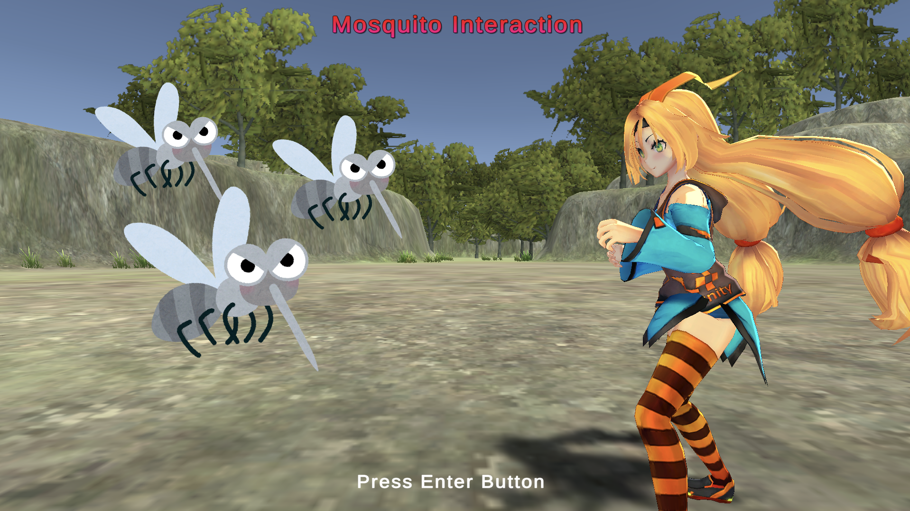
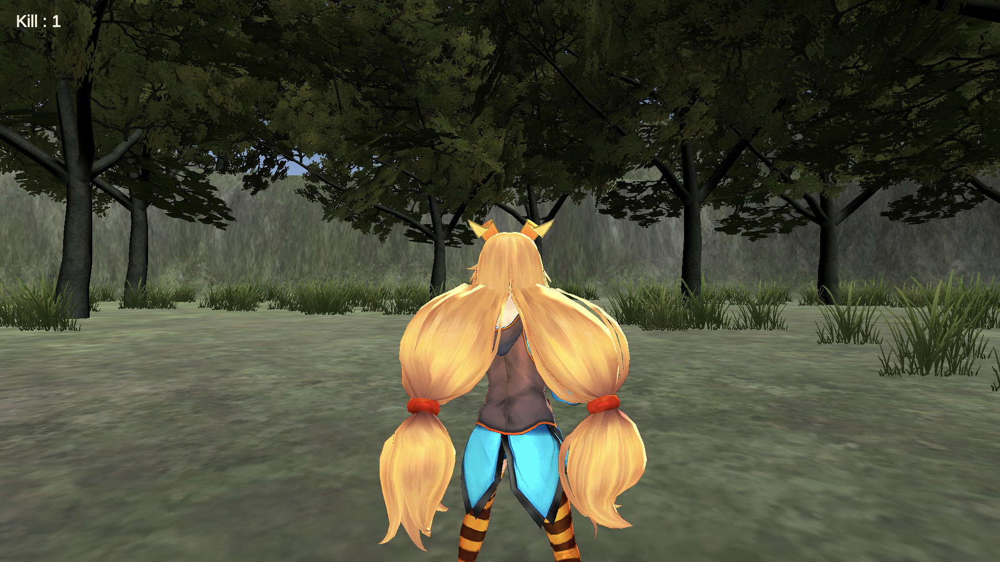

# mosquito_unity
### Unityを用いて開発した蚊との相互的なやり取りをするVRコンテンツです
- 蚊を接触した際にMicro:bitから電流が流れます
- Zで殺虫剤を撒くことで蚊を駆除出来ます
- Mでミュートに出来ます

### Motivation
- 蚊に刺されて痒い思いをした経験から、蚊への対策を練習出来るVRコンテンツを作成したいと考えました

### Trick
- 音の指向性の再現・音響のこだわり
- Micro:bitとのシリアル通信
- 殺虫剤のクールタイム実装

### unityroom
https://unityroom.com/games/mosquito_challenge

### デモ画像

### 環境
- Unity 2020.3.23
- ファイティングユニティちゃん
- Micro:bit
